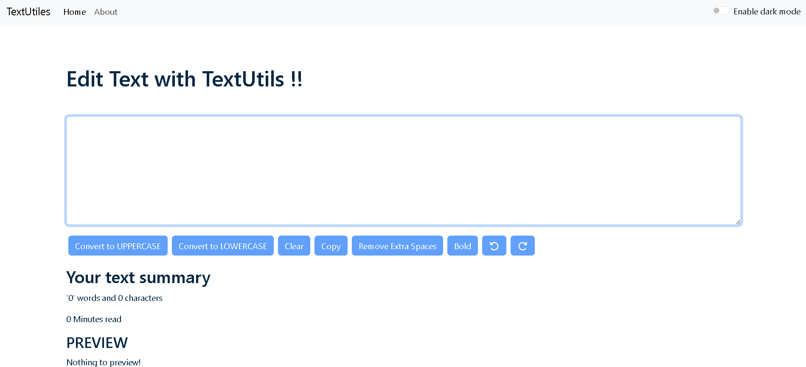
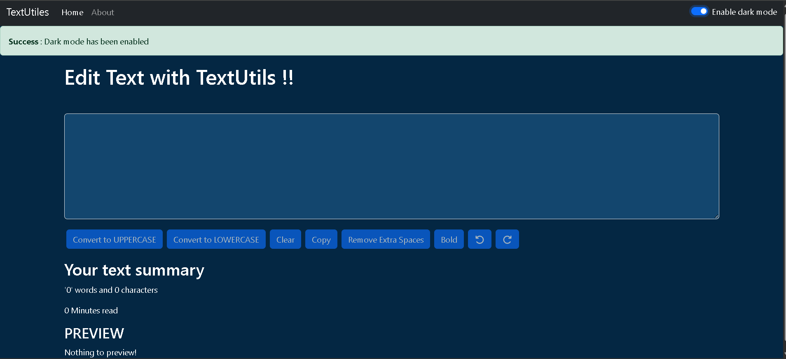

# TextUtils

A simple React-based text utility application that provides various text transformations such as converting text to uppercase/lowercase, removing extra spaces, copying text, and more.

---

## 🚀 Features

* Convert text to **Uppercase**
* Convert text to **Lowercase**
* **Remove extra spaces** from text
* **Copy text** to clipboard
* **Clear text** instantly
* **Dark/Light mode** support 
* Real-time **text summary** (word count, character count, reading time)

---

## 🛠️ Technologies Used

* **React JS**
* **Bootstrap**
* **JavaScript (ES6+)**
* **CSS**
* **HTML**

---

## 📂 Project Structure

```
TextUtils/
│   README.md
│   package.json
│   package-lock.json
│
└───src/
    │   App.js
    │   index.js
    │   App.css
    │
    └───components/
        │   About.js
        │   Navbar.js
        │   TextForm.js
        │   Alert.js
```

---

## 🔧 Installation & Setup

Follow these steps to run the project locally:

### 1️⃣ Clone the repository

```bash
https://github.com/MuskanPatel0027/TextUtils.git
```

### 2️⃣ Navigate to the project folder

```bash
cd TextUtils
```

### 3️⃣ Install dependencies

```bash
npm install
```

### 4️⃣ Start the development server

```bash
npm start
```

The app will run at:

```
http://localhost:3000/
```

---

## 📸 Screenshots




---





---

## ⭐ Show Your Support
If you like this project, please give it a ⭐ on GitHub!


## Author

Muskan Patel   
GitHub - MuskanPatel0027